# Лендинги

Два самостоятельных одностраничных сайта, собранные на чистом HTML + CSS + JavaScript, без фреймворков и сборки. Каждый лендинг лежит в своей папке и раздаётся через GitHub Pages.

**[→ Открыть витрину](https://sergeifed2015-pixel.github.io/landings/)**

| Сайт | Тематика | Ссылка |
|---|---|---|
| **Веха** | Юридическое бюро — банкротство физлиц | [veha/](https://sergeifed2015-pixel.github.io/landings/veha/) |
| **ЯГОДА** | Обжарочная мастерская спешелти-кофе, Орёл | [yagoda/](https://sergeifed2015-pixel.github.io/landings/yagoda/) |
| **ПРИБОЙ** | Школа сёрфинга с видеофоном, вкладками и записью, Сочи | [priboy/](https://sergeifed2015-pixel.github.io/landings/priboy/) |

---

##  Веха — юридическое бюро

> Ведём процедуру банкротства физических лиц по всей России дистанционно: от первой консультации до определения суда об освобождении от обязательств.

**Логотип** — график долга, который падает к нулю и выходит на плато, с охряным флажком-вехой в начале. Визуализирует главный посыл — «долг перестаёт расти, когда суд принял заявление». SVG в шапке сайта и как `favicon.svg`.

**[→ Открыть сайт](https://sergeifed2015-pixel.github.io/landings/veha/)**

### Скриншоты

<table>
  <tr>
    <td>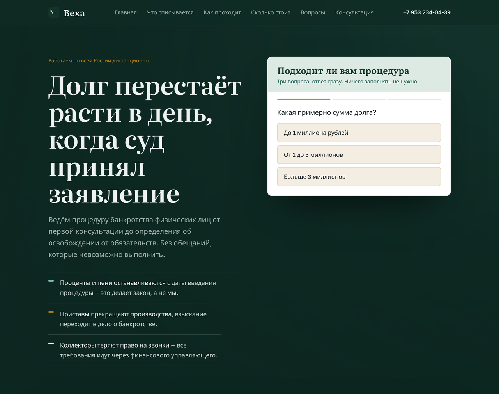<br/><sub>Первый экран + интерактивный тест «Подходит ли вам процедура»</sub></td>
    <td>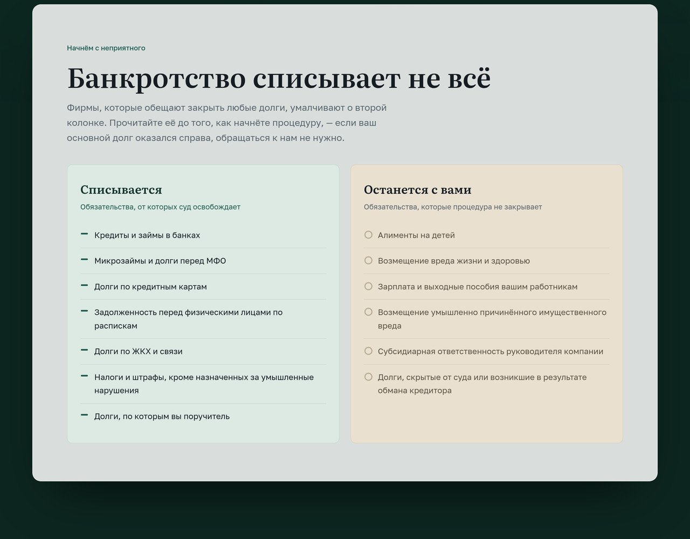<br/><sub>Что списывается, а что останется с вами — две честные колонки</sub></td>
  </tr>
  <tr>
    <td>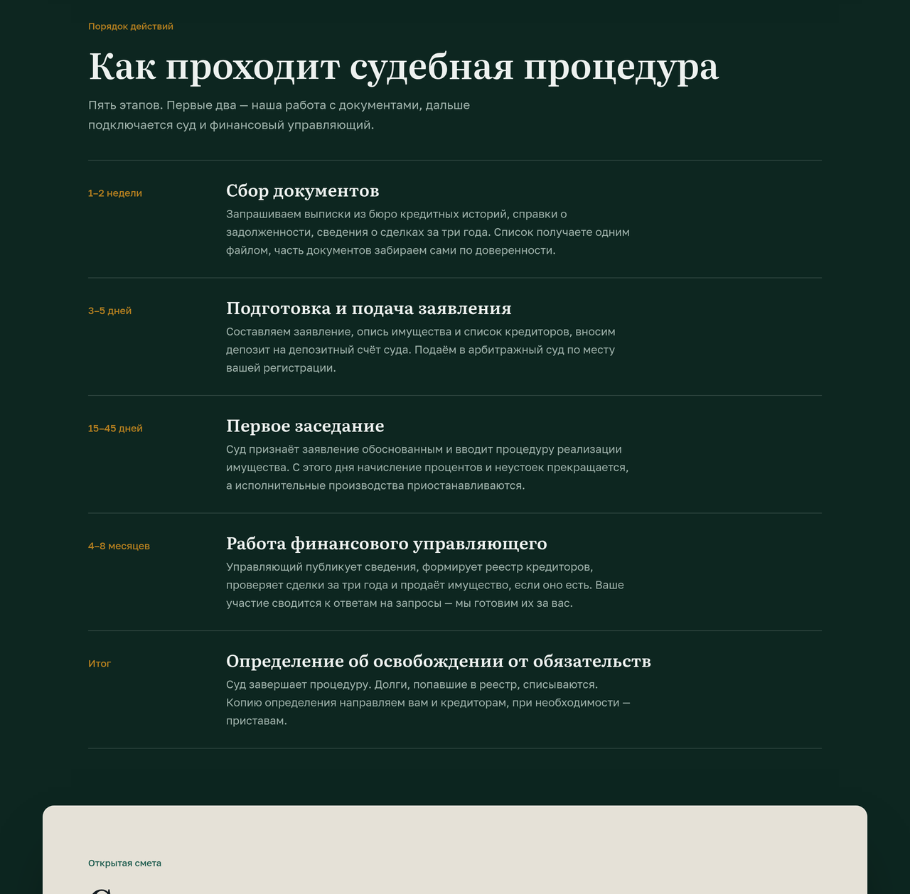<br/><sub>Как проходит судебная процедура — пять этапов со сроками</sub></td>
    <td>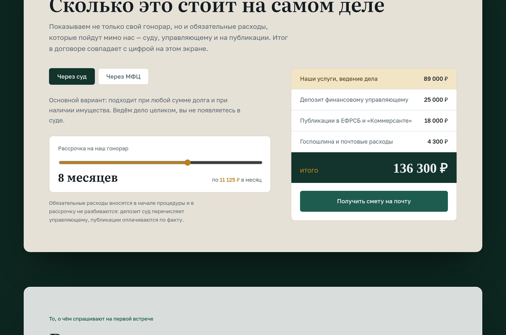<br/><sub>Калькулятор сметы с раскладкой всех расходов</sub></td>
  </tr>
</table>

### Возможности

- **Тест-квалификатор в 3 вопроса** — сумма долга, наличие имущества и просрочки; ответ показывается сразу, без формы и ожидания.
- **Блок «Банкротство списывает не всё»** — две колонки: какие долги списываются (кредиты, займы, МФО, ЖКХ, налоги) и что остаётся (алименты, вред жизни и здоровью, зарплата работникам, субсидиарная ответственность).
- **Пошаговая процедура** — 5 этапов от сбора документов до определения об освобождении, у каждого свой срок (1–2 недели → 3–5 дней → 15–45 дней → 4–8 месяцев → итог).
- **Калькулятор сметы** — ползунок рассрочки гонорара и раскладка обязательных расходов (депозит финуправляющего, публикации в ЕФРСБ и «Коммерсанте», почтовые расходы) с честным «итого».
- **FAQ** — 6 живых вопросов: единственное жильё, зарплата и карта, родственники, будущие кредиты, что делать прямо сейчас, гарантии.
- **Блок доверия** — счётчики: завершённых дел с 2021 года, средний срок процедуры, юристов в штате, стоимость консультации.
- **Форма записи на консультацию** с выбором суммы долга и предупреждением о согласии на обработку данных.
- Липкая навигация с якорями, отзывчивая вёрстка, экран-прелоадер и мягкие анимации появления секций.

**Контакты на сайте:** ООО «Веха» · тел. +7 953 234-04-39 · Telegram @Plain_gray01 · работаем по всей России дистанционно.

---

##  ЯГОДА — обжарочная мастерская

> Обжариваем спешелти-кофе в Орле по вторникам и пятницам небольшими партиями. Розница, подписка и опт для кофеен.

**Логотип** — кофейная ягода (вишня) в разрезе: внутри вишнёво-красной мякоти видно кофейное зерно, сверху фисташковый лист. Прямая иллюстрация слогана «Кофе — это ягода, а не порошок». SVG в шапке, в прелоадере и как `favicon.svg`.

**[→ Открыть сайт](https://sergeifed2015-pixel.github.io/landings/yagoda/)**

### Скриншоты

<table>
  <tr>
    <td>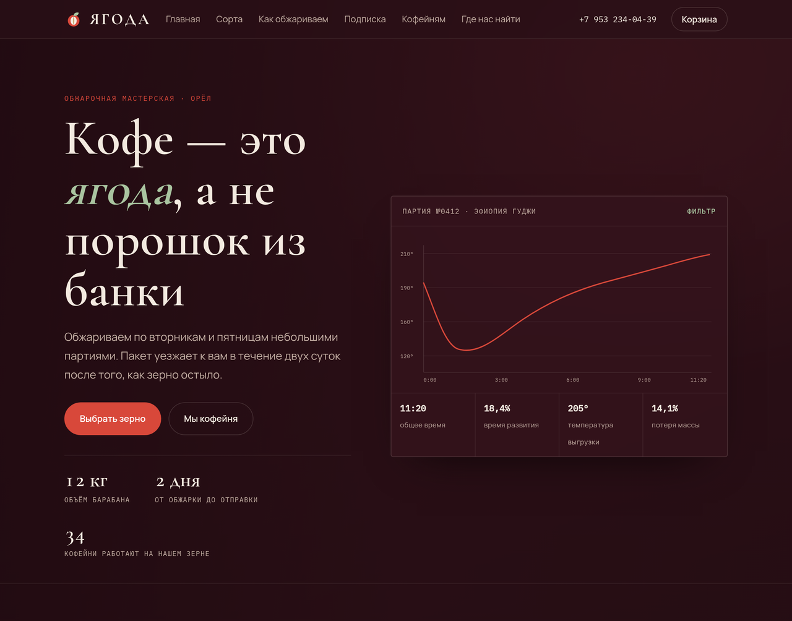<br/><sub>Первый экран с графиком развития обжарки партии</sub></td>
    <td>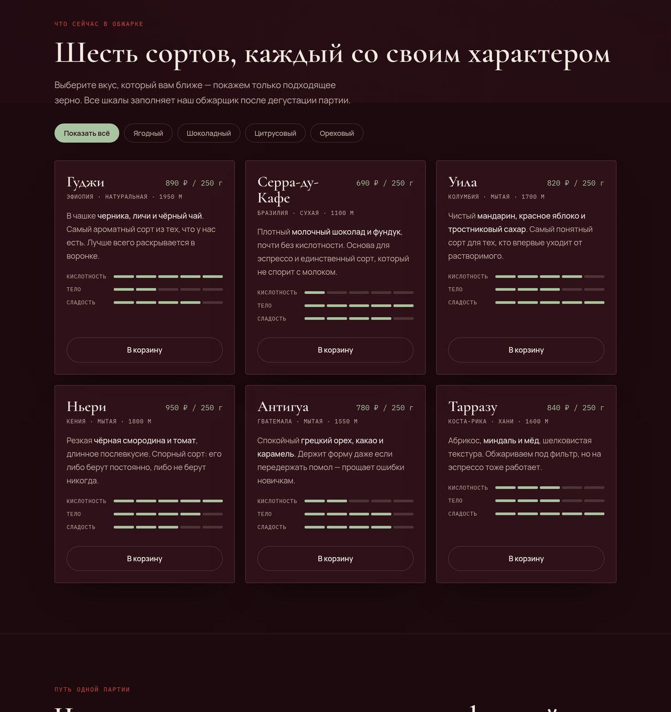<br/><sub>Шесть сортов со шкалами вкуса и фильтром по профилю</sub></td>
  </tr>
  <tr>
    <td>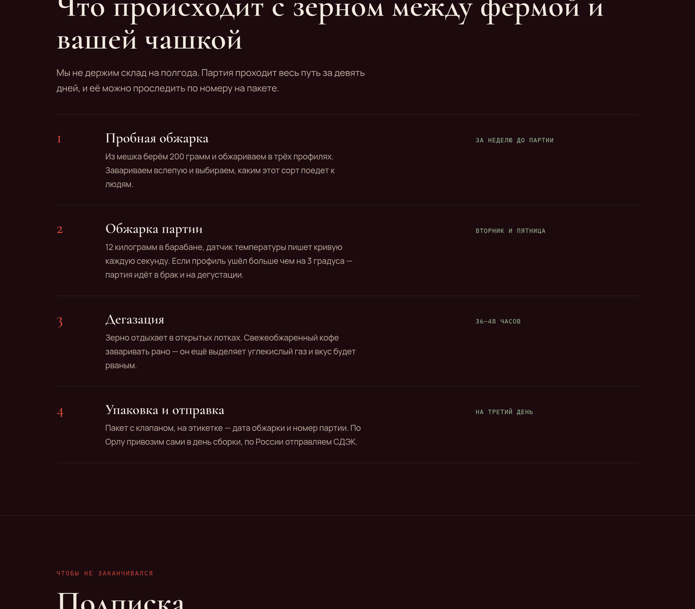<br/><sub>Путь одной партии — от пробной обжарки до отправки за 9 дней</sub></td>
    <td>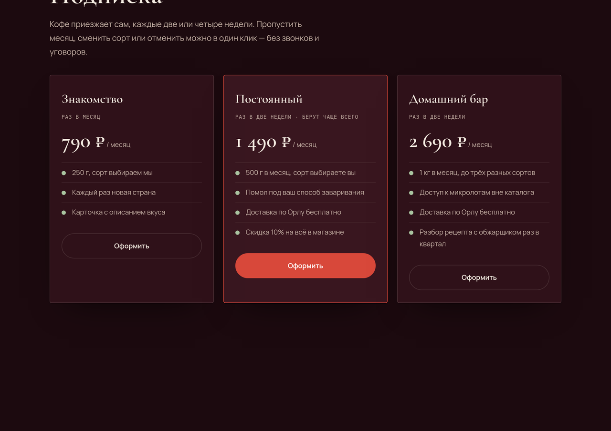<br/><sub>Три тарифа подписки: Знакомство, Постоянный, Домашний бар</sub></td>
  </tr>
</table>

### Возможности

- **Каталог из 6 сортов** (Гуджи, Серра-ду-Кафе, Уила, Ньери, Антигуа, Тарразу) — у каждого происхождение, обработка, высота, цена и описание вкуса.
- **Шкалы вкуса** для каждого сорта — кислотность, тело, сладость — заполняются обжарщиком после дегустации партии.
- **Фильтр по вкусовому профилю** — Ягодный / Шоколадный / Цитрусовый / Ореховый показывает только подходящее зерно.
- **Корзина** — выезжающая панель с добавлением товаров, оформлением и экраном подтверждения заказа.
- **«Путь одной партии»** — 4 шага от пробной обжарки и дегустации до упаковки и отправки за 9 дней, партию можно отследить по номеру на пакете.
- **Подписка** — три тарифа (Знакомство 790 ₽, Постоянный 1 490 ₽, Домашний бар 2 690 ₽) с раскладкой того, что входит.
- **Калькулятор опта** — ползунок объёма считает оптовую скидку и итоговую цену за килограмм прямо на странице.
- **Контакты и адрес цеха** с часами работы, приглашением попробовать свежую обжарку.
- Фоновое видео обжарки на первом экране, панель-переключатель секций, экран-прелоадер, отзывчивая вёрстка и анимации появления.

**Контакты на сайте:** Орёл, ул. Комсомольская, 41 · Пн–Пт 9:00–19:00, Сб 10:00–16:00 · тел. +7 953 234-04-39 · Telegram @Plain_gray01.

---

##  ПРИБОЙ — школа сёрфинга

> Учим сёрфингу с нуля до уверенного катания. Малые группы, сертифицированные тренеры, доски и гидрокостюмы включены. Сочи, Чёрное море.

**[→ Открыть сайт](https://sergeifed2015-pixel.github.io/landings/priboy/)**

**Логотип** — минималистичный знак-волна: два гребня (пена + аква) под коралловым «солнцем». Собран из двух брендовых цветов моря. SVG в шапке, в прелоадере и как `favicon.svg`.

### Скриншоты

<table>
  <tr>
    <td>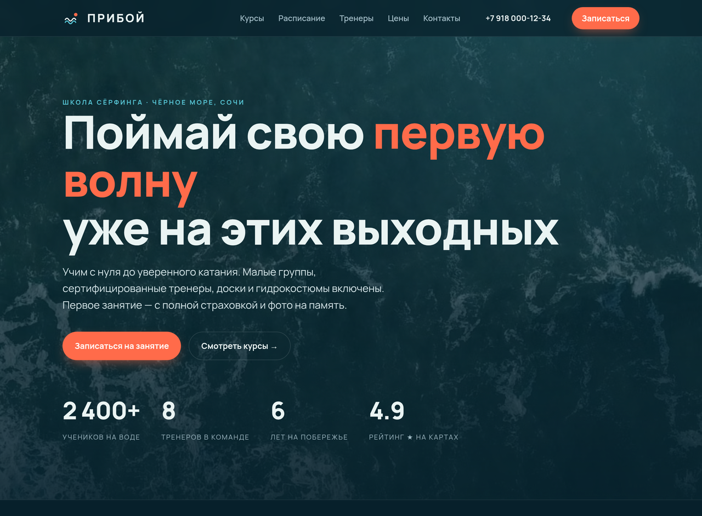<br/><sub>Первый экран с видео океана на фоне и счётчиками</sub></td>
    <td>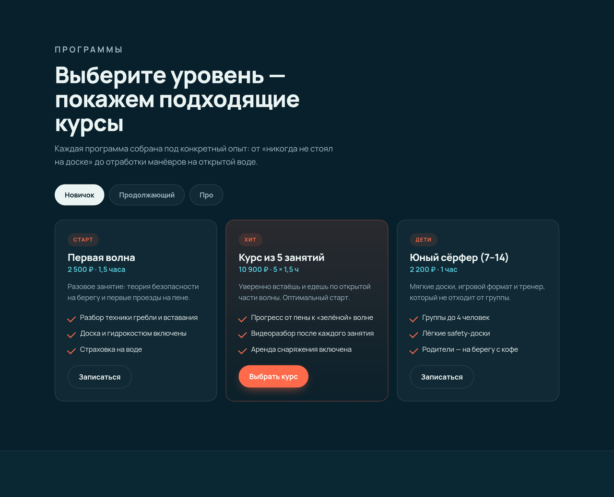<br/><sub>Курсы с вкладками по уровню: Новичок / Продолжающий / Про</sub></td>
  </tr>
  <tr>
    <td>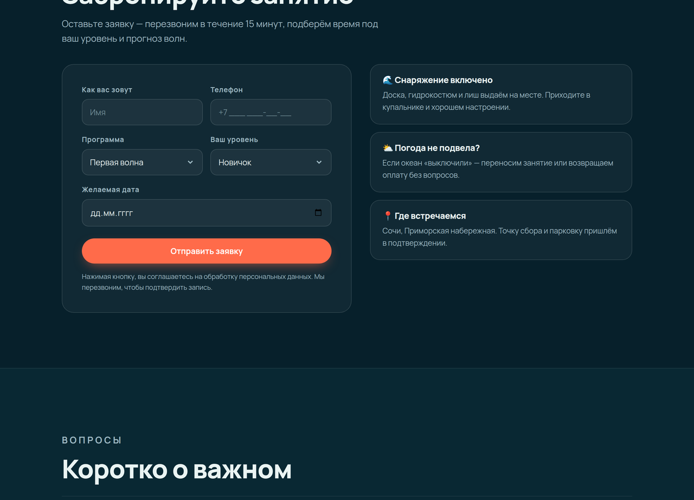<br/><sub>Рабочая форма записи с валидацией и экраном подтверждения</sub></td>
    <td valign="top"><b>Что интерактивного</b><br/><sub>Видеофон, мобильное меню, живое подчёркивание навигации, переключение вкладок, кнопки «Выбрать» подставляют программу в форму, отправка → экран подтверждения со сводкой, FAQ-аккордеон.</sub></td>
  </tr>
</table>

### Возможности

- **Видеофон** — фоновое видео океанских волн (Pexels) с постером и затемнением; можно положить свой ролик в `priboy/video/priboy-bg.mp4`.
- **Вкладки курсов** — три уровня (Новичок / Продолжающий / Про), у каждого свои программы: разовые занятия, курсы, интенсивы, детская группа, кемп, surf-guiding.
- **Вкладки расписания** — переключение по спотам («Маяк» / «Бухта» / «Пляж 40») с сеткой сессий и статусом мест.
- **Тренеры** — карточки команды с ролями и специализацией.
- **Абонементы** — три тарифа; кнопки «Выбрать» подставляют программу в форму записи и прокручивают к ней.
- **Форма записи** — валидация имени и телефона, экран подтверждения со сводкой (программа, уровень, дата) и кнопкой «Записать ещё».
- **FAQ** — аккордеон с частыми вопросами.
- **Мобильное меню**, липкая шапка, живое подчёркивание активного раздела, экран-прелоадер, отзывчивая вёрстка.

**Контакты на сайте:** Сочи, Приморская наб., 12 · ежедневно 7:00–20:00 · тел. +7 918 000-12-34 · Telegram @priboy_surf.

---

## Технологии

Чистый **HTML + CSS + JavaScript** — без фреймворков, без сборки, без зависимостей. Шрифты подключаются с Google Fonts, всё остальное работает в браузере. Хостинг — **GitHub Pages**.

## Структура

```
.
├── index.html        витрина со ссылками на лендинги
├── veha/index.html   лендинг юридического бюро
├── yagoda/index.html лендинг обжарочной мастерской
├── priboy/index.html лендинг школы сёрфинга (видеофон, вкладки, форма)
└── assets/           скриншоты для README
```

## Локальный запуск

```bash
git clone https://github.com/sergeifed2015-pixel/landings
cd landings
python3 -m http.server 8080
# открыть http://localhost:8080
```
